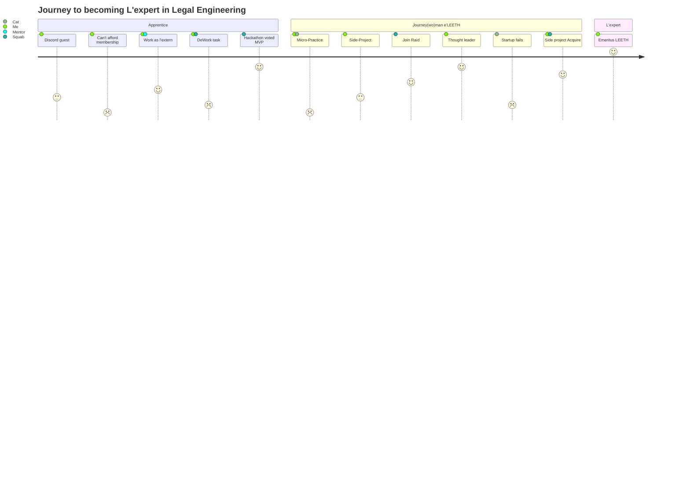

# Legal Engineers

## What is Legal Engineering?

There are many definitions (see [background](https://www.legalbusinessworld.com/post/2020/02/17/an-essay-on-legal-engineering-from-confusion-to-clarity)) but for LexDAO purposes: 

`the design of computational law applications`

Legal Engineering Certification by [LexDAO vote](https://gnosis-safe.io/app/#/safes/0x5B620676E28693fC14876b035b08CbB1B657dF38/transactions) of your peers requires demonstrated: 
- contributions in the field of computational law (developing H-shaped skills in code+law);
- aptitude in web3 applications and design (including understanding wet-ink contracts);
- support of LexDAO initiatives to further the same (eg mentoring, thought leadership).

What does this mean in practice? Check out some projects being built by LexDAO engineers:
- [KALI DAO Incorporator](https://app.kalidao.xyz/)
- [Real Property Tokenization](https://lexdao.substack.com/p/when-daos-get-real-managing-real?s=r)
- [Open Source Law](https://github.com/ErichDylus/Open-Source-Law)
- [AI powered crypto wallet assistant](https://nani.ooo/)

## Is there a path to certification?

Joining the LexDAO squabbles in discord, contributing to research and working group discussions, publishing articles, and similar, are great ways to demonstrate qualifications. A more linear path based on skill-trees would involve: 
1. 🧙 writing and deploying a smart contract with legal applications or high regulatory compliance,
2. 🏹 designing a legal framework for people using smart contract instruments/mechanisms, and 
3. 🏴‍☠️ working on a LexDAO engineering project (see above) via hackathons or sprints as l'expert.

## Why apply for LexDAO certification?

LexDAO Engineers (see roster below) have established reputation and work history among law firms and web3 protocols. Joining our ranks lets the public know you support our mission and have been vetted. You can append "| LexDAO" as your discord handle, add "LexDAO Engineer" in your twitter or law firm bio, or unlock additional powers with affiliated partners. Being a LexDAO engineer also makes you eligible to serve in more advanced legal engineering roles within our network, like working on digital arbitration panels or being on editorial board of our journals. Plus you'd be getting a NFTy dynamic badge once we get our collective trustmark registered.

## Eligibility to join LexDAO Legal Engineering

We have a dual path where apprentices who have established legal training (J.D., paralegal experience, etc.) gains practice in coding value, dispute and other legal engineering protocols --or-- skillup [developers](https://www.lexology.com/library/detail.aspx?g=f8d9bb92-3779-4bc2-9f1b-7354d416acb1) or project managers in cyberlaw, RegTech and compliance. We point out that Legal Enginner **CANNOT** give legal advice (unless admitted to the bar) but would have a working knowledge at least at the paralegal level.

Join our [discord chat](https://discord.com/invite/M4jxXmk) and check out our `Member` channel to learn more (ask for guest pass in `introductions` if you can't see that channel).

## LexDAO Legal Engineers 🕶️ 1Q2024

| Name | Ethereum Address | Notes |
|----------|:-------------:|:-----:|
| Ross Campbell | [`0x1C0Aa8cCD568d90d61659F060D1bFb1e6f855A20`](https://etherscan.io/address/0x1c0aa8ccd568d90d61659f060d1bfb1e6f855a20) | $${\color{white}Lvl 5 Cryptowizard}$$ |
| Robert Leonhard | [`0xcC4Dc8e92A6E30b6F5F6E65156b121D9f83Ca18F`](https://etherscan.io/address/0xcc4dc8e92a6e30b6f5f6e65156b121d9f83ca18f) |$${\color{white}Lvl 4 MetaMagician}$$ |
| Joshua Ma | [`0xf290f3d843826d00f8176182fd76550535f6dbb4`](https://etherscan.io/address/0xf290f3d843826d00f8176182fd76550535f6dbb4) | 
| Alex Fagella | [`0x756CE9C56B02f05b5FaFfaFc707B552bEDce83eE`](https://etherscan.io/address/0x756ce9c56b02f05b5faffafc707b552bedce83ee) | $${\color{white}Lvl 3 Sourceror}$$ |
| James McCall | [`0xd5B3988eD0AB5ec375E51bB6fd10e205cEC16A2E`](https://etherscan.io/address/0xd5B3988eD0AB5ec375E51bB6fd10e205cEC16A2E) | $${\color{white}Lvl 3 Serjeant}$$ |
| Scott Stevenson | [`0x130093A5aEbc07e78e16f0EcEF09d1c45AfD8178`](https://etherscan.io/address/0x130093A5aEbc07e78e16f0EcEF09d1c45AfD8178) | $${\color{white}Lvl 4 Illusionist}$$ |
| Adam Kerpelman | [`0xa3564677FC4907A15c9A7EAe1DBc1ae9aC57b8E1`](https://etherscan.io/address/0xa3564677FC4907A15c9A7EAe1DBc1ae9aC57b8E1) | $${\color{white}Lvl 3 Serjeant}$$ |
| Stamford Hwang | [`0x4744cda32bE7b3e75b9334001da9ED21789d4c0d`](https://etherscan.io/address/0x4744cda32bE7b3e75b9334001da9ED21789d4c0d) | $${\color{white}Lvl 4 MetaMagician}$$ |
| Bill Warren | [`0x7136fbDdD4DFfa2369A9283B6E90A040318011Ca`](https://etherscan.io/address/0x7136fbDdD4DFfa2369A9283B6E90A040318011Ca) | $${\color{white}Lvl 4 Evoker}$$ |
| Erich Dylus | [`0xb7f49e02552751b249cae86959fd50d887708b1d`](https://etherscan.io/address/0xb7f49e02552751b249cae86959fd50d887708b1d) | $${\color{white}Lvl 4 Metamagician$$ |
| Nick Rishwain | [`0xCbbd18d3aC27ab0FFfD04BCCd091B2802c92e0ca`](https://etherscan.io/address/0xCbbd18d3aC27ab0FFfD04BCCd091B2802c92e0ca) | $${\color{white}Lvl 3 Herald}$$ |
| Shivanshi Tyagi | [`0xcb0592589602b841be035e1e64c2a5b1ef006aa2`](https://etherscan.io/address/0xcb0592589602b841be035e1e64c2a5b1ef006aa2) | $${\color{white}Lvl 3 Summoner}$$ |
| Lawrence Lau | [`0x85384c23d8ae724a094b5592c53ad4015bc94574`](https://etherscan.io/address/0x85384c23d8ae724a094b5592c53ad4015bc94574) | $${\color{white}Lvl 4 DAOsigner}$$ |
| Jordan Teague | [`0xE3bbFD7dbd338a2C1c4F28F8e06aC00589118c4B`](https://etherscan.io/address/0xE3bbFD7dbd338a2C1c4F28F8e06aC00589118c4B) | $${\color{white}Lvl 3 Enchantress}$$ |
| Larry Florio | [`0xc04aFCeEA0BE5A8CeCe930c4e6208eb03BeCd066`](https://etherscan.io/address/0xc04aFCeEA0BE5A8CeCe930c4e6208eb03BeCd066) | $${\color{white}Lvl 4 Sniper}$$ |
| Geoff Costeloe | [`0x82fab1819986492A0799f65B4DdfB6B570F881E0`](https://etherscan.io/address/0x82fab1819986492A0799f65B4DdfB6B570F881E0) | $${\color{white}Lvl 3 Slinger}$$ |
| Gaurav Gopinath | [`0xdf01f0c6152253f45d492176c9f69ba5058b6b13`](https://etherscan.io/address/0xdf01f0c6152253f45d492176c9f69ba5058b6b13) | 
| Jared Cohen | [`0xb42Ce7ce6eE1Dd2B7959DD6c120eFAE8Ec288E03`](https://etherscan.io/address/0xb42Ce7ce6eE1Dd2B7959DD6c120eFAE8Ec288E03) | $${\color{white}Lvl 3 Sourceror}$$ |
| Kyle Smith | [`0x0D89421D6eec0A4385F95f410732186A2Ab45077`](https://etherscan.io/address/0x0D89421D6eec0A4385F95f410732186A2Ab45077) | $${\color{white}Lvl 3 Slinger}$$ |
| Arvind Alexander | [`0x48A64aDbb34837F3Bf4d40BCc40C85bBCa1A3a84`](https://etherscan.io/address/0x48A64aDbb34837F3Bf4d40BCc40C85bBCa1A3a84) | 
| Matt Blaine | [`0xECa5e3CE0774372e71cE9b3675CB07c6677C2d52`](https://etherscan.io/address/0xECa5e3CE0774372e71cE9b3675CB07c6677C2d52) | 
| Mark Dittrich | [`0x509Bed05fA643cc4023620652b5c03d15d7E911a`](https://etherscan.io/address/0x509Bed05fA643cc4023620652b5c03d15d7E911a) | 
| Gianluca Cattin | [`0xC316f415096223561e2077c30A26043499d579aD`](https://etherscan.io/address/0xC316f415096223561e2077c30A26043499d579aD) | 
| Nick Viavant | [`0xCC976F37b22B67660D78D9BA9157ABC2131c6F5d`](https://etherscan.io/address/0xCC976F37b22B67660D78D9BA9157ABC2131c6F5d) | $${\color{white}Lvl 3 Mage}$$ |
| ??? | [`0xbAEE49c72026bC7C4Baa6b446E288535Ec22F020`](https://etherscan.io/address/0xbAEE49c72026bC7C4Baa6b446E288535Ec22F020) |
| ??? | [`0x82ab35094Fa962646a0D1baAB2866F7350B98D79`](https://etherscan.io/address/0x82ab35094Fa962646a0D1baAB2866F7350B98D79) |

[Legal Engineer NFT Registry](https://opensea.io/collection/lexdao-engineering) but not for sale.✨
